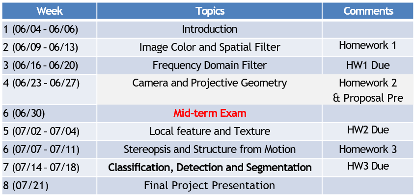
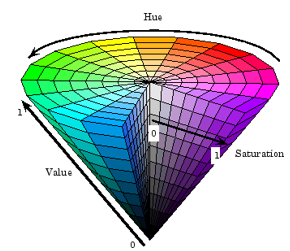

# 1. Introduction

## About the Course

Instructor: 李镇

### Reference Textbooks:

### Grading:

- 3 Assignments: 10% x 3
- Midterm: 30%
- Project: 35%
- Attandance: 5%

### Final Project

| Content              | DDL  |
| -------------------- | ---- |
| Project proposal     | 6.25 |
| Project presentation | 7.21 |

### Math Skills Required:

Calculus, linear algebra, probability and statistics, simple differential equations, differential geometry, harmonic analysis...

## Background

### What is computer vision?

image -> sensing device -> interpreting device -> interpretations

- goal: bridge the gap between **pixels** and **meanings**

## Applications
