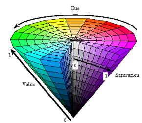

# 2. Images, Colors and Filters

## Images acquisition, sampling and quantization

### Images acquisition

How do humans see the colors of objects?

- That's determined by the nature of the light reflected from the objects.

2 Different types of lights:

- Monochromatic light: only has intensity
- Chromatic light: has radiance, luminance, brightness
  - **lm** is an objective amount, it's the energy that an observer perceives from the light
  - **brightness** is a subjective amount. Can't be measured.

#### Some physical concepts:

**Illumination:**

unit: lumen / m^2

**Reflectance（透光率）:**

How strong the object will reflect light. (0 < r < 1)

For example:

r(velvet) < r(wall paint) < r(metal) < r(snow)

#### How to transform illumination energy into digital images?

Using sensors and sensor strips.

A simple model:

f(x, y) = i(x, y) \* r(x, y)

#### Difference of Human Visual System (HVS) and Digital Sensors:

**Brightness Adaptation**:

- The human eye's judgment of the brightness of a certain area strongly depends on the brightness of the surrounding areas.
- Brightness perception is not isolated or absolute, but relative and contrastive.
- Thus, when processing images, we should make some modifications to adapt to human eyes.
  

### Image Sampling and Quantization

Use digital pixels to approximately represent real images.

#### Representin Digital Images

Use a matrix of M \* N.

> Assume the discrete intensity interval is [0, L-1], and L = 2^k,
> Then the number of bits required to store an M \* N image is:
> b = M \* N \* k

#### Spatial and Intensity Resolution（分辨率）

- Spatial intensity: pixels per unit distance.
- Intensity resolution: smallest discernible change in intensity level.

### Image Interpolation

#### What is interpolation?

Process of using known data to estimate unknow data.

We can use it to increase/decrease the number of pixels in a digital image.

e.g.: zooming pictures, rotating pictures, ...

#### Different types of interpolation:

Nearest Neighbor Interpolation

Bilinear Interpolation

Bicubic Interpolation

## Image Colors

### How to represent different color-type images?

**Binary images:**

A matrix of 0s and 1s

**Grayscale images:**

A matrix of numbers from 0 to 255

**Color images:**

Usually 3 matrices of 3 channels (RGB).

### Color Space

#### Linear Color Spaces:

Choose 3 primary colors (they can't be on the same line), then we can represent any color using the weights of the primaries（原色）.

e.g.: RGB space uses red, green and blue.

#### Nonlinear Color Spaces:

e.g.: HSV space


#### Converting from RGB to HSI

Refer to p58 of Week 2 PPT.

#### Converting from HSI to RGB

Refer to p61 of Week 2 PPT.

### White Balance

#### What is white balance?

It's the process of removing unrealistic color casts, so that objects which appear white in person are rendered white in your photo.

## Image Histograms

### What is a histogram of an image?

```py
# im is an array that stores the intensity(brightness) value of an image.
def histogram(im):
    h = np.zeros(255)
    for row in im.shape[0]:
        for col in im.shape[1]:
            val = im[row, col]
            h[val] += 1
    return h
```

#### Normalized Histogram:

```py
def normalized_histogram(im):
    p = np.zeros(255)
    # Compute how many pixels are in the image
    total_pixels = im.shape[0] * im.shape[1]
    for row in im.shape[0]:
        for col in im.shape[1]:
            val = im[row, col]
            # Divide the total pixels number
            p[val] += 1 / total_pixels
    return p
```

p(r_k) is the probability of drawing the gray level r_k

Histogram of an image provides the frequency of the intensity value in that image.

### Histogram Equalization

Modify the histogram -> let the probability spread equally -> Increase the contrast of the image

- transformation T(.): make the output values uniformly distributed in [0, L-1].

#### What is it?

### Histogram Matching

## Images are functions

## Linear Systems (Filters)

## Convolution and correlation
